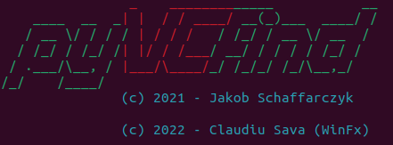

# pyVCfind - find VeraCrypt containers easily
## How does it work?
VeraCrypt do not have any magic bytes, MIME types or obvious metadata one could use for finding those. But in fact, it has some structural weaknesses which could be used for deterministic detection. **Important**: Although it might not happen that often, the script won't provide 100% correct results and is therefore provided as is.

### Signature
VeraCrypt containers appear as binary data blobs. There's no MIME type which can be assigned to them, so it's described as `application/octet-stream; charset=binary`. This could be a first, but weak indicator.

### Filesize
VeraCrypt creates its containers in blocks of 512B size. Therefore the filesize must be a multiple of 512. In addition to that, the minimum size of a VeraCrypt container is 292KB, so the filesize has to exceed 299008 bytes to be of interest.

### Entropy
Encrypted files often have a very high entropy. If both of the above mentioned conditions fit to a file, the entropy will be calculated. When the default entropy threshold of 7.999 will be exceeded, the file will be most likely a VeraCrypt container or any other encrypted file.

### Caveats
Also other "readable" file formats may have a high entropy (like MP4). If they are corrupt and therefore no magic bytes are detected, this may lead to a **false/positive**.

*You can read more about this topic [here](https://www.raedts.biz/forensics/detecting-truecrypt-veracrypt-volumes/).*

## Usage
`usage: pyVCfind.py [-h] [-d DIRECTORY] [-f FILE] [-t THREADS] [-e ENTROPY]`

| short | long | default | description | 
| ----- | ---- | ------- | ----------- |
| -h | --help | - | show this help message and exit |
| -d | --directory | DIRECTORY | Directory to scan for VeraCrypt containers |
| -f | --file | FILE | Check if file could be a container or not | 
| -t | --threads | THREADS | Number of threads to spawn. Default is 4. |
| -e | --entropy | ENTROPY | Entropy threashold which must be exceeded. Default is 7.999 |

*Either (-f) or (-d) is required to run*

You can try this by scanning the attached **secret** container.

## Example
> 
> 
> `python3 pyVCfind.py -d ~/Documents/Python/`

~ Cheers